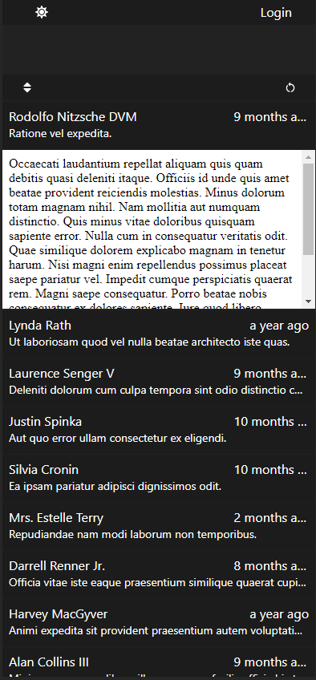

# ReactMailing 📬

An app that lets user check their email using Imap Server with infinite scrolling <br>
First time using react.

## Tech Stack :floppy_disk:

**Client:** React, Typescript, TailwindCSS, Twind

**Server:** Node, Express

**Testing** Storybook

## Run Locally :computer:

Clone the project

```bash
  git clone https://github.com/Indeedornot/ReactMailing
```

Go to the project directory

```bash
  cd ReactMailing
```

Install dependencies

```bash
  npm install
```

Start the server

```bash
  npm run dev
```

## Screenshots

<div align='center'>


| Light Mode                         | Dark Mode                         |
| ---------------------------------- | --------------------------------- |
|  |  |

</div>

## Roadmap :world_map:

- [ ]  Add the ability to demo the app
- [ ]  Sort devDeps and Deps, remove unused
- [ ]  Fix iframe flashing on Chrome
- [ ]  Fix inconsistend styling - className vs const
- [ ]  Rewrite with clean code principles
- [ ]  Add cors support
- [ ]  Add sizing support
- [ ]  Add Demo Option
